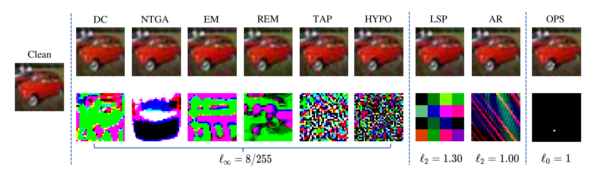

# APBench: A Unified Availability Poisoning Attack and Defenses Benchmark
[](https://www.python.org/downloads/release/python-3817/)
[](https://pytorch.org/)
[](https://github.com/lafeat/apbench/blob/main/LICENSE)

Availability poisoning is an emerging and popular topic that investigates stealthy alterations on data to make that data unusable for deep learning model training. Recent papers have proposed a number of usability poisoning attacks and defenses. It is important to establish a benchmark to review current progress and facilitate future research in the area of availability poisoning. APBench aims to provide easy implementations of availability poisoning attack & defense methods to facilitate future research as well as a comprehensive evaluation of existing attack and defense methods. We eagerly welcome you to contribute your availability poisoning attack & defense methods to APBench.

<p align="center">
   <a href="https://openreview.net/pdf?id=igJ2XPNYbJ"> Paper (TMLR version) </a > •  <a href="https://apbench.github.io/"> Leaderboard </a>
<br>
</p>


### ❗v1.1 Model Updates
Considering the black-box poisoning scenario, we additionally add 2 transformer-based models ViT and CaiT.
- **[vit_small.py](./nets/vit_small.py)**: ViT-small model.
- **[cait_small.py](./nets/cait_small.py)**: CaiT-small model.

## Table of Contents

* [Overview](#Overview)
* [Installation](#Installation)
* [Code Structure](#code-structure)
* [Quick Start](#quick-start)
* [Supported Methods](#supported-methods)
* [Unsupervised Methods](#unsupervised-methods)

## Overview

APBench contains the following attacks and defenses:

**Attacks**:
  - 11 availability poisoning attack methods:
  [DeepConfuse](https://papers.nips.cc/paper_files/paper/2019/file/1ce83e5d4135b07c0b82afffbe2b3436-Paper.pdf),
  [NTGA](http://proceedings.mlr.press/v139/yuan21b/yuan21b.pdf),
  [EM](https://openreview.net/pdf?id=iAmZUo0DxC0),
  [REM](https://openreview.net/pdf?id=baUQQPwQiAg),
  [HYPO](https://arxiv.org/pdf/2102.04716.pdf),
  [TAP](https://arxiv.org/pdf/2106.10807.pdf),
  [LSP](https://arxiv.org/pdf/2111.00898.pdf),
  [AR](https://arxiv.org/pdf/2206.03693.pdf),
  [OPS](https://arxiv.org/pdf/2205.12141.pdf),
  [UCL](https://arxiv.org/pdf/2202.11202.pdf),
  [TUE](https://arxiv.org/pdf/2210.10114.pdf).
  
**Defenses**: 
  - 4 availability poisoning attack methods:
  [AT](https://arxiv.org/pdf/1706.06083v2.pdf),
  [ISS](https://arxiv.org/pdf/2301.13838.pdf),
  [UEraser](https://arxiv.org/pdf/2303.15127.pdf),
  [AVATAR](https://arxiv.org/pdf/2303.08500.pdf).
  
**Datasets**: CIFAR-10, CIFAR-100, SVHN, ImageNet-Subset (100).
 
**Models**: ResNet-18, ResNet-50, SENet-18, MobileNet-V2, DenseNet-121, Vit-small, CaiT-small.
 
## Installation
You can run the following script to configurate necessary environment:

```shell
conda create -n apbench python=3.8
conda activate apbench
pip install -r requirements.txt
```

## Code Structure

```
├── dataset 
│   ├── <Dataset> # For clean dataset.
│   ├── <Type>_poisons # For poisoned dataset.
│   ├── <Supervised_type>_pure # Poisoned dataset for supervised learning.
│   └── <Unsupervised_type>_pure # Poisoned dataset for unsupervised learning.
│       └── <Arch> # Unsupervised arch: simclr and moco.
├── defense 
│   └── diffusion # For defense AVATAR
│       └── pretrained
│           └── score_sde
│               └── checkpoint_8.pth # Pretrained diffusion model for CIFAR-10
└── log # contains checkpoints
    └── <Dataset> # Dataset type. e.g. c10, c100, imagenet100, and unsupervised.
        └── <Type> # Attack type. e.g. em, rem ...
```
You should download pretrained checkpoint [checkpoint_8.pth](https://drive.google.com/drive/folders/1xYjVMx10N9ivQQBIsEoXEeu9nvSGTBrC) 
from [Guided-diffusion](https://github.com/yang-song/score_sde_pytorch)
following the code structure.


## Quick Start

**Step 1: Generate poisoned datasets**: 
For example, if you want to generate poisoned datasets of EM, you should run with a demo script below:.
```shell
python em_poisons.py --type em --dataset <Dataset> --eps <Eps_bound>
```
The parameter choices for the above commands are as follows:
- --dataset `<Dataset>`: `c10` , `c100`, `svhn`, `imagenet100`.
- --type `<Attack>`: `ar`, `dc`, `em`, `rem`, `hypo`, `tap`, `lsp`, `ntga`, `ops`.
P.S. `em`, `rem` and `lsp` support [`c10` , `c100`, `svhn`, `imagenet100`]; `ops` and `ar` support [`c10` , `c100`, `svhn`]; `dc`, `hypo`, `tap` and `ntga` support [`c10`].

**Step 2: Training on poisoned datasets**: 
If you have already generated poisoned dataset, you can train the model with a demo script below:
```shell
python train.py --dataset <Dataset> --<Defense> --arch <Model_arch> --type <Attack>
```
The parameter choices for the above commands are as follows:
- --dataset `<Dataset>`: `c10` , `c100`, `svhn`.
- --`<Defense>`: `nodefense`, `cutout`, `cutmix`, `mixup`, `mixup`, `bdr`, `gray`, `jpeg`, `gaussian`, `ueraser`, `at`.
- --arch `<Model_arch>`: `r18`, `r50`, `se18`, `mv2`, `de121`, `vit`, `cait`.
- --type `<Attack>`: `ar`, `dc`, `em`, `rem`, `hypo`, `tap`, `lsp`, `ntga`, `ops`.


The above process does not include the AVATAR defense method,
if you need to implement AVATAR defense, follow the script below：

**Step 1: Generate poisoned datasets**: 
For AVATAR, you should also firstly generate poisoned datasets following the above script.

**Step 2: Generate purified datasets**: 
If you have already generated poisoned dataset, you can generate the purified dataset with script below:
```shell
python pure_gen.py --dataset <Dataset> --type <Attack>
```
**Step 3: Training on purified datasets**: 
Then, train the model on processed dataset with script below:
```shell
python train.py --pure --dataset <Dataset> --arch <Model_arch> --type <Attack>
```
The parameter choices for the above commands are as follows:
- --dataset `<Dataset>`: `c10` , `c100`, `svhn`.
- --arch `<Model_arch>`: `r18`, `r50`, `se18`, `mv2`, `de121`, `vit`, `cait`.
- --type `<Attack>`: `ar`, `dc`, `em`, `rem`, `hypo`, `tap`, `lsp`, `ntga`, `ops`.
  
The trained checkpoints will be saved at `log/<Dataset>/<Attack>/`.
You need to confirm that the target poisoned dataset has been generated in advance.

## Supported Methods

| Attacks          | File name                                                  |
|-      |-      | 
| DeepConfuse      | [dc_poisons.py](attack/dc_poisons.py)      | 
| NTGA             | [ntga_poisons.py](./attack/ntga_poisons.py)| 
| EM               | [em_poisons.py](./attack/em_poisons.py)      | 
| REM              | [rem_poisons.py](./attack/rem_poisons.py)   | 
| HYPO             | [hypo_poisons.py](./attack/hypo_poisons.py)| 
| TAP              | [tap_poisons.py](./attack/tap_poisons.py)   | 
| LSP              | [lsp_poisons.py](./attack/lsp_poisons.py)   | 
| AR               | [ar_poisons.py](./attack/ar_poisons.py)      | 
| OPS              | [ops_poisons.py](./attack/ops_poisons.py)   | 


| Defenses         | File name                                                  |
|-      |-      | 
| AT               | [madrys.py](./madrys.py)                                 | 
| ISS              | -                                                          | 
| UEraser          | [ueraser.py](./defense/ueraser.py)                         | 
| AVATAR           | [diffpure.py](./defense/diffusion/__init__.py)             | 

You can refer to these codes and modify them according to your needs.

## Unsupervised Methods
  
For unsupervised Methods, 
you can go to their repositories 
([UCL](https://github.com/kaiwenzha/contrastive-poisoning) and [TUE](https://github.com/renjie3/TUE)) 
to download the perturbations.pt.
Then, you can train the unsupervised model with a demo script below:
```shell
python us_train.py --dataset <Dataset>  --arch <Model_arch> --type <Attack>
```
The parameter choices for the above commands are as follows:
- --dataset `<Dataset>`: `c10` and `c100`.
- `--<Defense>`: `jpeg` and `gray`.
- --arch `<Model_arch>`: `simclr` and `moco`.
- --type `<Attack>`: `ucl` and `tue`.
 
For UEraser and AVATAR, you should 
firstly generate the processed dataset with script below:
```shell
python pure_us_gen.py --dataset <Dataset>  --arch <Model_arch> --defense <Defense> 
```
- --defense `<Defense>`: `ueraser` for UEraser and `pure` for AVATAR.

Then, you can train the unsupervised model on UEraser or AVATAR with a demo script below:
```shell
python us_train_pu.py --dataset <Dataset>  --arch <Model_arch> --defense <Defense> 
```
## Dataset source

We use the pre-processed ImageNet-100 [Download Link](https://github.com/TerryLoveMl/ImageNet-100-datasets).
You can also get ImageNet-100 by slicing ImageNet-1K (slight difference in sample size).

## Citation

If you find this benchmark or code is helpful for your research, please cite our paper:
```bib
@article{qin2024apbench,
  title={{APBench}: A Unified Availability Poisoning Attack and Defenses Benchmark},
  author={Tianrui Qin, Xitong Gao, Juanjuan Zhao, Kejiang Ye, Cheng-zhong Xu},
  journal={Transactions on Machine Learning Research (TMLR)},
  year={2024},
  url={https://openreview.net/forum?id=igJ2XPNYbJ},
}
```
